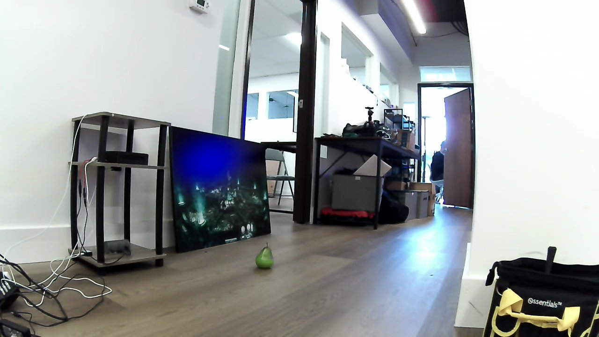
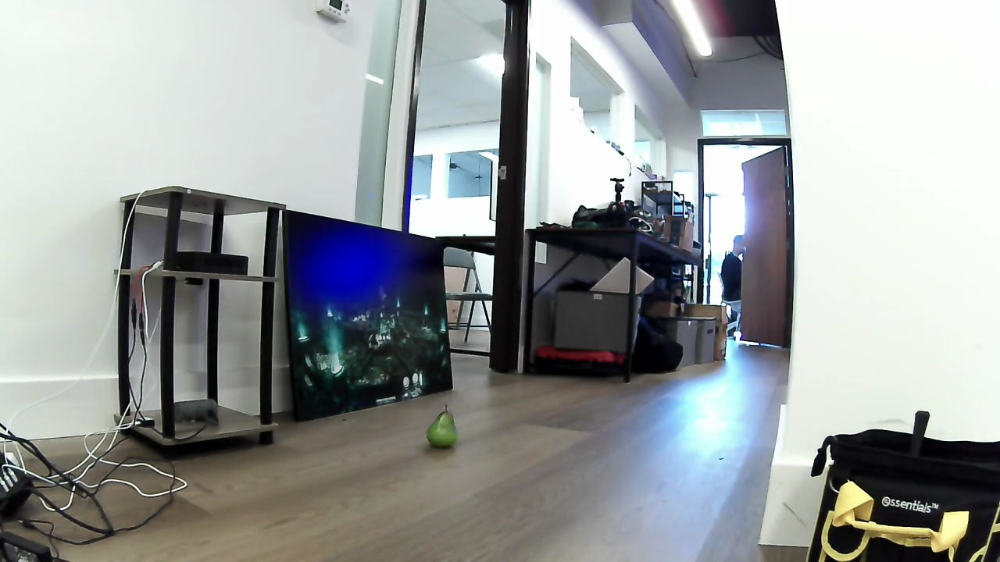
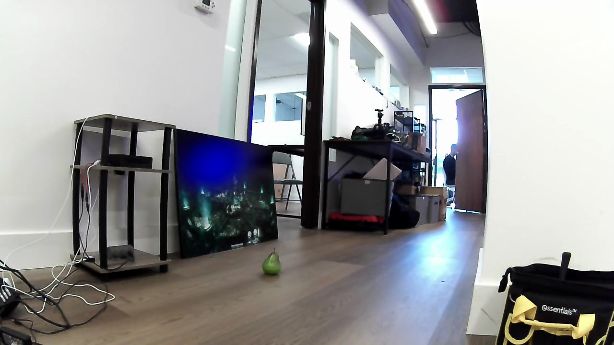
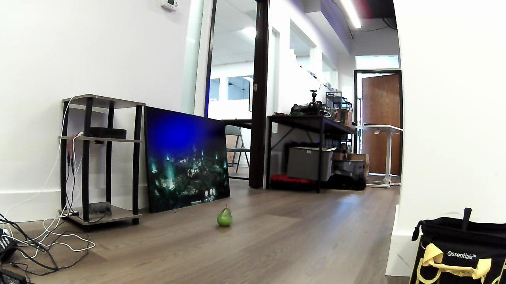
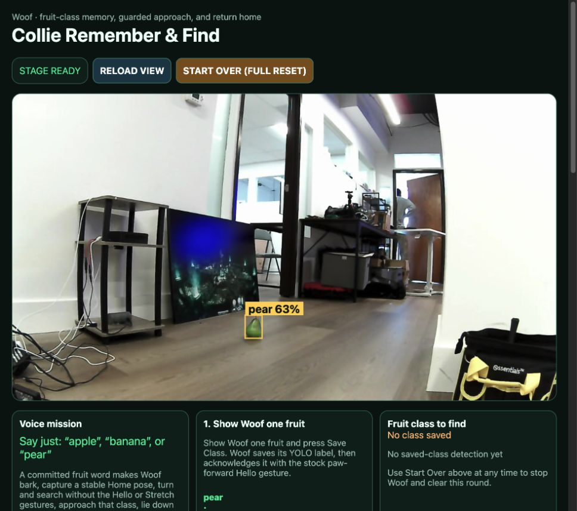
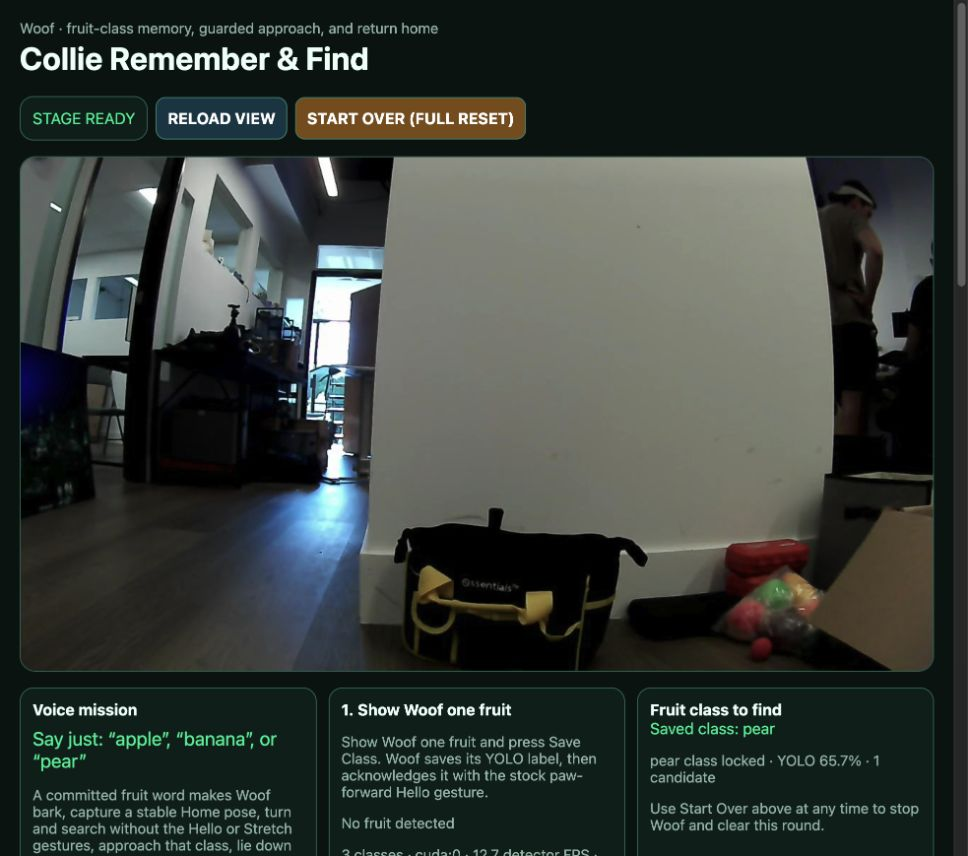
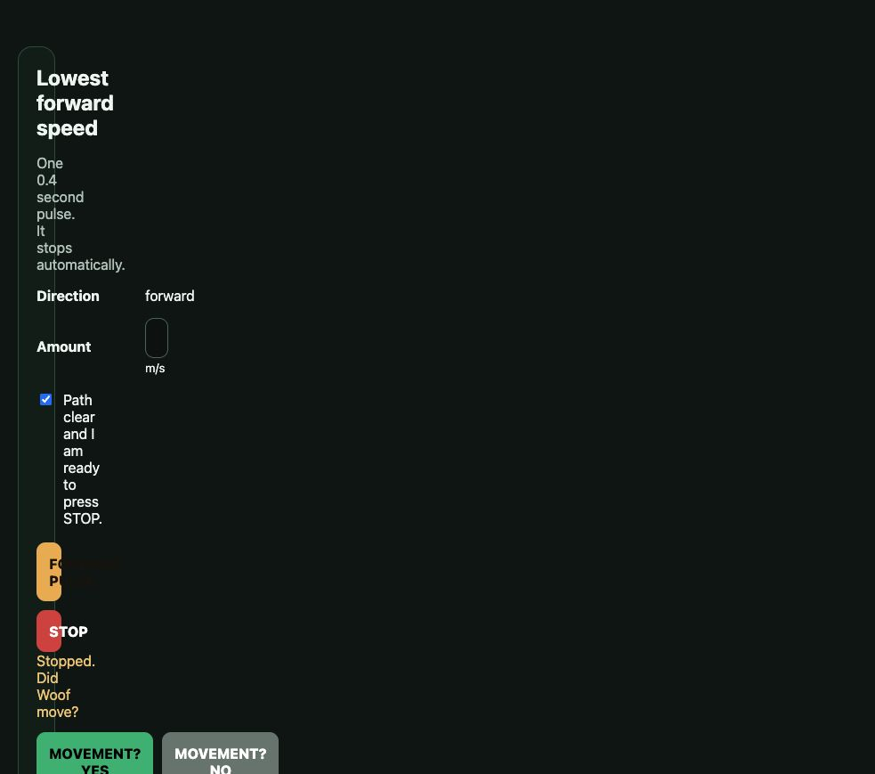

# Collie demo validation results

A test is marked complete only when it has explicit pass criteria, a compact
machine-readable result, and a visual snapshot of the tested scene. Motion is
never implied by a perception-only test.

## Completed

### FRUIT-PEAR-001 — Pear recognition in a fixed scene

**Status:** Completed — passed
**Duration:** 59.493 seconds
**Mode:** Read-only; no target selection or motion commands

Pass criteria:

- At least 80% of eligible fresh samples detect `pear` at or above the deployed
  35% class threshold.
- Camera, broker, GPU, and detector remain healthy for every sample.
- No stale frames, frozen counters, request failures, or camera-generation
  changes occur.

Result:

- Pear detected in 114 of 114 eligible samples: **100%**.
- Confidence range: **58.7–72.0%**; mean **66.0%**.
- Health samples: **120 of 120 passed**.
- Camera generation changes: **0**.
- Broker rate: **14.1–14.4 FPS**; runtime rate: **9.3–10.5 FPS**.
- Maximum detector age: **132 ms**; mean inference time: **102 ms**.

Evidence: [compact result](../artifacts/validation/pear-recognition-01.json) ·
[scene snapshot](../artifacts/validation/pear-recognition-01.jpg)

### CAM-SOAK-001 — Camera and detector continuity soak

**Status:** Completed — failed
**Planned duration:** 30 minutes
**Observed duration:** 112.482 seconds; stopped after the first acceptance
failure
**Mode:** Read-only; no target selection or motion commands

Pass criteria:

- Complete 30 minutes with no stale frames, frozen counters, endpoint failures,
  reconnects, or generation changes.

Result:

- Health samples: **225 of 226 passed**.
- At 74.6 seconds, both the main `8096` status request and voice/camera `8098`
  status request timed out.
- Main request duration: **1047 ms**; camera request duration: **3006 ms**.
- The next sample was healthy and the WebRTC camera generation did not change.
- The run was stopped because a zero-failure pass was no longer possible.

This does not yet prove that the camera producer froze. Both HTTP endpoints
failed together while the WebRTC generation remained stable, so the next test
uses Woof's resolved IP address instead of `woof.local` to separate mDNS or
client-network delay from an application stall.

Evidence: [compact result](../artifacts/validation/camera-soak-01.json) ·
[post-recovery snapshot](../artifacts/validation/camera-soak-01.jpg)

### CAM-IP-001 — Direct-IP responsiveness isolation

**Status:** Completed — failed
**Duration:** 120.614 seconds
**Mode:** Read-only; direct IP; no target selection or motion commands

Pass criteria:

- Complete two minutes with no stale frames, frozen counters, endpoint
  failures, responses slower than one second, reconnects, or generation
  changes.

Result:

- Health samples: **239 of 240 passed**.
- At 91.2 seconds, the main `8096` status response took **1177 ms**; the
  camera/broker `8098` response completed in **265 ms**.
- The maximum broker, runtime-frame, and detector ages remained fresh at
  **107 ms**, **187 ms**, and **170 ms**, respectively.
- Camera generation changes: **0**.
- The main endpoint recovered without a camera reconnect.

Using `192.168.0.107` rules out `woof.local` name resolution as the sole cause.
The isolated slow `8096` response, alongside fresh camera and detector state,
does not indicate a WebRTC camera freeze. `CAM-MAIN-001` follows up by breaking
request latency into connection, pre-response, and transfer phases.

Evidence: [compact result](../artifacts/validation/camera-ip-01.json) ·
[post-test snapshot](../artifacts/validation/camera-ip-01.jpg)

### CAM-MAIN-001 — Main-status phase timing with camera-service control

**Status:** Completed — failed
**Samples:** 120 new direct-IP TCP connections per service
**Mode:** Read-only; no target selection or motion commands

Pass criteria:

- Both services return every response in under one second.
- Main `8096` must not show a server-wait pattern that is absent from the
  camera/broker control on `8098`.

Result:

- Main `8096`: **1 of 120** responses exceeded one second; maximum **1092 ms**.
- Camera/broker `8098`: **3 of 120** responses exceeded one second; maximum
  **1271 ms**.
- Mean TCP connection time was similar: **126 ms** on `8096` and **123 ms** on
  `8098`.
- Maximum TCP connection time was also similar: **900 ms** and **916 ms**.
- JSON response transfer was fast: mean **0.8 ms** on `8096` and **0.2 ms** on
  `8098`.

The slow responses are not isolated to the main status handler. Comparable
connection and pre-response delays occurred on both ports, while response
transfer remained negligible. This points to shared Wi-Fi/network or host
scheduling latency; it does not show that the camera or detector pipeline
stopped producing frames.

Evidence: [compact result](../artifacts/validation/camera-timing-01.json) ·
[post-test snapshot](../artifacts/validation/camera-timing-01.jpg)

### NET-PATH-001 — Network-path latency correlation

**Status:** Completed — passed
**Duration:** 120.257 seconds; 240 synchronized samples
**Mode:** Read-only; direct IP; no target selection or motion commands

Pass criteria:

- Collect at least 200 synchronized ICMP and fresh-TCP samples over two minutes.
- Receive every ICMP echo and valid response from both status services.
- Classify a shared-path contribution only if ICMP latency correlates with both
  TCP services at Pearson `r >= 0.8`, and the two services correlate with each
  other at `r >= 0.8`.

Result:

- Packet loss and HTTP request failures: **0**.
- ICMP latency: **3.4 ms minimum**, **10.7 ms mean**, **243.8 ms maximum**;
  three samples exceeded 100 ms.
- Main `8096`: **29.9 ms mean**, **468.0 ms maximum**; no response exceeded one
  second.
- Camera/broker `8098`: **27.6 ms mean**, **467.8 ms maximum**; no response
  exceeded one second.
- Correlation was strong: ICMP-to-main **0.946**, ICMP-to-camera **0.953**, and
  main-to-camera **0.976**.
- At 119.8 seconds the largest event was synchronized: ICMP reached **243.8
  ms**, while both TCP responses reached approximately **468 ms**.

The synchronized slowdown shows that the shared Wi-Fi/network path materially
contributes to the observed response spikes. This bounded run did not reproduce
a one-second failure, and it does not rule out host scheduling as an additional
cause. The camera frame remained available immediately after the test.

Evidence: [compact result](../artifacts/validation/network-path-01.json) ·
[post-test snapshot](../artifacts/validation/network-path-01.jpg)

### CAM-RECONNECT-001 — Forced WebRTC peer-loss and recovery

**Status:** Completed — failed
**Mode:** Forced loss of only the voice/WebRTC container while Woof was idle;
no motion commands

Pass criteria:

- Woof remains stopped and disarmed throughout the interruption.
- The voice service reconnects with a new generation, the main runtime remains
  available, and fresh camera/detector state returns within 30 seconds.
- The recovered microphone can transcribe a safe non-command phrase and the
  recovered bark path is audible.

Result:

- Safety passed: mission remained idle, motion stayed disarmed, and no motion
  owner appeared.
- Recovery produced **two** replacement camera generations instead of one.
- Fresh broker frames returned **23.0 seconds** after the first endpoint
  failure.
- The main runtime restarted and did not resynchronize with the final camera
  generation until **45.6 seconds** after the first failure.
- Camera, GPU, and detector readiness returned after **52.3 seconds**.
- Bark passed: the endpoint reported `bark_played` and the operator heard it.
- Microphone failed human qualification: its audio quality was unusable and
  the safe phrase did not appear. The operator requested a replacement
  microphone before further voice testing.

The reconnect path failed its bounded-recovery requirement, although it failed
safe with no locomotion. Voice-command qualification is blocked on replacing
the microphone.

Evidence: [compact result](../artifacts/validation/camera-reconnect-01.json) ·
[post-recovery snapshot](../artifacts/validation/camera-reconnect-01.jpg)

### CAM-SOAK-002 — Full camera and detector continuity soak

**Status:** Completed — passed
**Duration:** 1799.507 seconds; 3600 samples
**Mode:** Read-only; direct IP; no target selection or motion commands

Pass criteria:

- Complete 30 minutes with no stale frames, frozen counters, endpoint failures,
  responses slower than one second, reconnects, or generation changes.

Result:

- Health samples: **3600 of 3600 passed**.
- Endpoint failures, stale frames, and frozen counters: **0**.
- Camera generation changes: **0**.
- Broker rate: **13.4–15.3 FPS**; runtime rate: **9.1–10.4 FPS**.
- Maximum broker frame age: **199 ms**; maximum runtime frame age: **238 ms**.
- Maximum detector age: **433 ms**; maximum inference time: **412 ms**.
- Maximum main-status response: **403 ms**; maximum camera-status response:
  **555 ms**.

The camera, broker, runtime, and detector stayed continuously fresh for the
full acceptance window. This qualifies steady-state camera continuity on the
tested direct-IP network path. It does not clear the separate failed forced
reconnect result.

Evidence: [compact result](../artifacts/validation/camera-soak-02.json) ·
[post-test snapshot](../artifacts/validation/camera-soak-02.jpg)

### NAV2-PREFLIGHT-001 — Stationary mapping and return-planner readiness

**Status:** Completed — passed
**Mode:** Stationary recovery and read-only qualification; no Home capture,
navigation goal, or motion command

Pass criteria:

- RTAB-Map remains running, publishes a fresh map and localization pose, and
  creates a healthy replacement database.
- All Nav2 lifecycle nodes become active and the navigation action is ready.
- The main demo reports `stage_ready` and `nav2_ready` while the mission remains
  idle and motion remains disarmed with no owner.

Result:

- Root cause identified: the persistent 595 MiB RTAB-Map SQLite database was
  malformed, causing RTAB-Map to exit before publishing `map` or `map -> odom`.
- The corrupt file was preserved recoverably as
  `/maps/collie-rtabmap.corrupt-20260731T232817Z.db` and only the Nav2 autonomy
  container was restarted.
- RTAB-Map created a fresh database and continued processing at 2 Hz.
- Controller, smoother, planner, behavior, and behavior-tree navigator nodes
  all activated; the gateway reported map, localization, scan, odometry, and
  Nav2 healthy.
- The main demo reported **STAGE READY** and the return planner reported Nav2
  ready with fresh localization, map, and Hesai scan.
- Safety remained closed: mission idle, navigation idle, motion disarmed,
  motion owner absent, and no Home or validation pose saved.

This passes the stationary return-planner preflight only. A subsequent guarded
test must still capture Home and validate actual return motion with a human
ready to stop Woof.

Evidence: [compact result](../artifacts/validation/nav2-preflight-01.json) ·
[ready-state snapshot](../artifacts/validation/nav2-preflight-01.jpg)

### RETURN-HOME-001 — Guarded full-sequence Nav2 return

**Status:** Completed — failed
**Duration:** 61.849 seconds
**Mode:** Human-guarded typed `pear` full sequence with the physical stop
control ready

Pass criteria:

- Capture a stable map-frame Home pose before outbound motion.
- Complete the guarded turn, pear lock, approach, arrival rest, stand-up, and
  Nav2 return without losing camera, map, localization, scan, or motion health.
- Finish within 10 cm and 5 degrees of Home, then stop and release all motion
  ownership.

Result:

- Home capture passed with 10 map-frame samples, **0.2 mm** maximum position
  span, and **0.07°** maximum heading span.
- Woof completed a measured **173.8°** turn, locked the pear with two fresh
  confirmations, approached it, stopped, and completed the arrival rest.
- Nav2 prealigned for Home, remained localization/map/scan healthy, and made
  **0.166 m** of measured return progress with one recovery.
- The 45-second return envelope expired after **37.762 seconds** of active Nav2
  navigation with **0.207 m remaining**. The 10 cm position gate and 5-degree
  heading gate were therefore not satisfied.
- The mission aborted, both STOP paths were issued, and independent
  verification confirmed zero velocity, motion disarmed, and no motion owner
  or fault in either the main runtime or Nav2 gateway.

This validates the outbound sequence and fail-safe stop behavior, but the
return is not qualified. The next pass should diagnose how the configured
return envelope is apportioned between prealignment, planning, recovery, and
path following before changing any timeout or controller value.

Evidence: [compact result](../artifacts/validation/return-home-01.json) ·
[post-stop snapshot](../artifacts/validation/return-home-01.jpg)

### MOTION-DEADBAND-001 — Factory-avoidance forward-command deadband

**Status:** Completed — passed
**Date:** 2026-07-31
**Mode:** Human-observed, forward-only 0.4-second pulses through Unitree's
factory `ObstaclesAvoidClient` remote-command path

Pass criteria:

- Identify the smallest tested command that produces visible physical forward
  movement.
- Confirm automatic STOP after every pulse and no retained motion ownership.

Result:

- **0.25 m/s: NO movement.**
- **0.50 m/s: YES, physical movement.**
- **1.00 m/s: YES, physical movement.**
- Operator conclusion: **0.50 m/s is the smallest movement signal Woof can
  reliably receive through this command path.**
- The live 1.00 m/s probe was observed in runtime telemetry as exactly 1.00
  m/s, confirming that the calibration path did not clamp the entered value.
- Each pulse stopped automatically; final verification showed zero velocity,
  motion disarmed, no motion owner, and full stage readiness.

Treat 0.50 m/s as the durable minimum reliable forward command for the factory
avoidance interface until it is recalibrated. This result does not yet prove
the same threshold for Nav2's separate direct `SportClient` handoff.

Evidence: [compact result](../artifacts/validation/forward-deadband-01.json) ·
[calibration snapshot](../artifacts/validation/forward-deadband-01.jpg)

### NAV2-DEADBAND-001 — Direct SportClient forward-command deadband

**Status:** In progress — two working values confirmed
**Date:** 2026-07-31
**Mode:** Human-observed, forward-only 0.4-second pulses through the direct
`SportClient` handoff used by Nav2

Observed result:

- **0.25 m/s: YES, physical step.**
- **0.50 m/s: YES, physical step.**
- The operator explicitly distinguished a physical step from repeated posture
  settling.
- Each calibration pulse used the no-clamp direct path and stopped
  automatically.

Integration decision:

- Use **0.25 m/s as the provisional minimum positive Nav2 forward command**.
- Preserve explicit zero, stale, reverse, and rotation-only commands without a
  forward boost.
- Do not call 0.25 m/s the exact direct-path deadband boundary until lower
  values have been tested and a snapshot has been captured.

## Observed runs awaiting complete evidence

### RETURN-HOME-002 — Full sequence after direct-command calibration

**Status:** Observed failure — not marked complete; no test snapshot is
attached yet
**Mode:** Human-guarded typed full sequence

Observed result:

- The approach declared `target_visible_near_arrival` at a bounding-box height
  ratio of **0.11**, then skipped the configured final approach entirely. Its
  commanded and measured final-approach distances were both **0.0 m**.
- The return prealignment turned Woof toward Home, but Nav2 then failed after
  **11.137 seconds** with `Home navigation made no measurable progress` and
  **0.2764 m** remaining.
- Localization, map, and scan stayed healthy, and the failure path stopped and
  disarmed motion.

Offline correction prepared:

- A visible near-fruit signal no longer ends the approach. After repeated
  near-fruit evidence, the fruit must leave the lower camera edge before one
  fixed **1.0 m/s**, **0.4-second** forward push runs and stops. The obsolete
  10 cm distance calibration has been removed.
- Nav2 now uses `PoseProgressChecker`, so **3°** of in-place rotation counts as
  progress. Its controller attempt expires after **5 seconds**, leaving time
  for recovery before the gateway's outer **8-second** stall guard.
- The gateway retains the global path, raw `/cmd_vel`, shaped relay command,
  command counters, and a bounded command trace after failure. This will make
  the next turn-then-stall result distinguish controller, relay, and path
  behavior.

This run remains incomplete under the repository's evidence rule until the
corrected build is deployed, the guarded acceptance criteria are repeated,
and a compact result plus snapshot are attached.

## Pending

- `VOICE-MIC-001`: replace the microphone and repeat safe-phrase transcription
  without issuing an allowlisted fruit command.
- `RETURN-HOME-DIAG-001`: explain why the 45-second return envelope expired
  while Nav2 was still making progress, including time spent prealigning,
  planning, recovering, and following the path.
- `NAV2-DEADBAND-001`: test direct values below 0.25 m/s and capture the final
  calibration snapshot; 0.25 and 0.50 m/s are already confirmed working.
- `RETURN-HOME-002`: deploy the offline correction and repeat the guarded
  return; require the same 10 cm, 5-degree, disarmed final gates, compact
  result, and snapshot.
